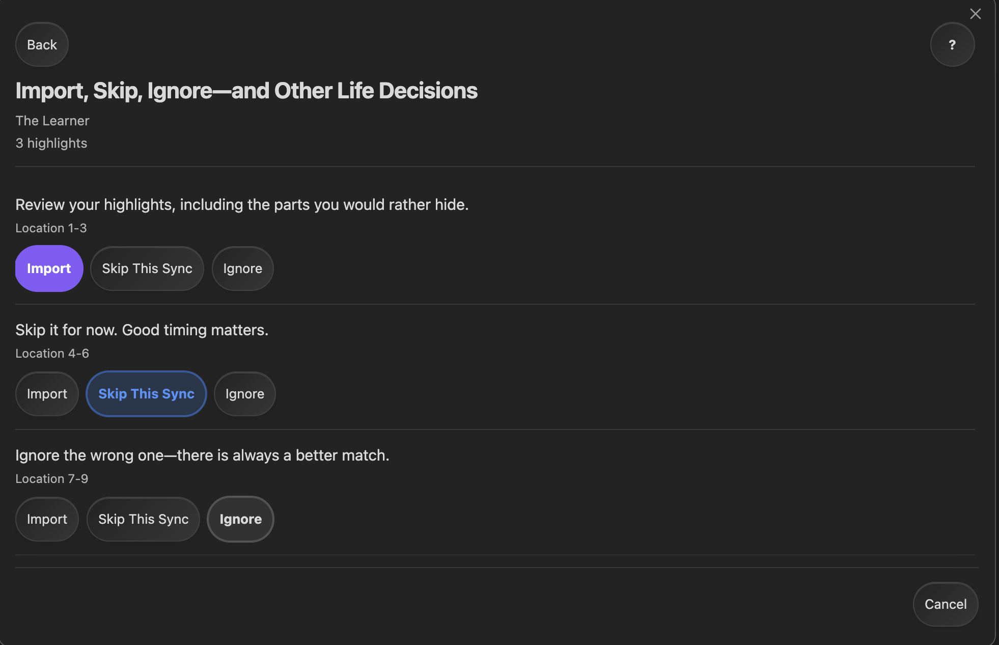
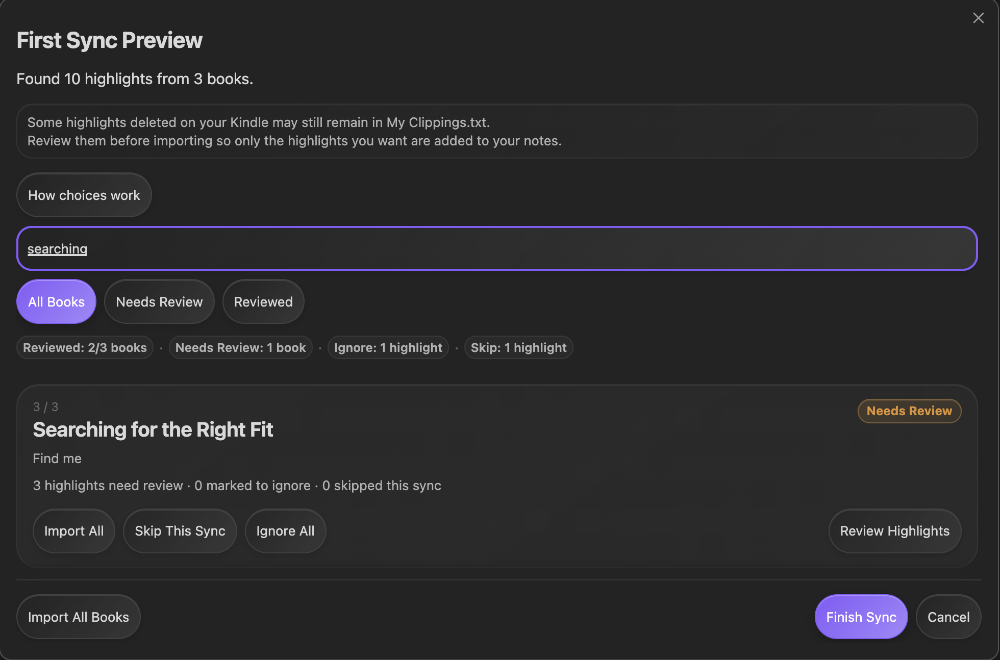

# Kindle Local Sync

Đưa highlight Kindle vào Obsidian mà không gửi dữ liệu đọc sách của bạn đi đâu cả.

Kindle Local Sync là plugin Obsidian chỉ dành cho máy tính. Plugin đọc file `My Clippings.txt` cục bộ từ Kindle và tạo ghi chú Markdown gọn gàng cho những highlight bạn chọn giữ lại.

## Demo


## 📖 Vì sao nên dùng?

- Giữ highlight Kindle gần các ghi chú và dự án nơi bạn sẽ dùng chúng.
- Review highlight mới trước khi chúng được thêm vào vault.
- Mỗi cuốn sách có một ghi chú Markdown.
- Kết nối lại các ghi chú Kindle Local Sync hiện có sau khi nâng cấp hoặc khi thiếu dữ liệu plugin.
- Giữ nội dung riêng của bạn tách khỏi phần mà plugin cập nhật.

## Ngôn ngữ

- [English](README.md)
- [Tiếng Việt](README.vi.md)
- [简体中文](README.zh-CN.md)
- [繁體中文](README.zh-TW.md)

## Bạn cần gì

- Obsidian trên máy tính.
- Kindle có file `My Clippings.txt` cục bộ, thường có khi kết nối Kindle bằng USB.
- Một vault Obsidian để lưu ghi chú sách.

## Cài đặt

Sau khi plugin có mặt trong Obsidian Community Plugins:

1. Mở **Settings** → **Community plugins** → **Browse**.
2. Tìm **Kindle Local Sync**.
3. Chọn **Install**, rồi **Enable**.

Với bản beta, chỉ dùng BRAT hoặc GitHub Release ZIP khi bạn chủ động thử một bản prerelease.

## 🧭 Bắt đầu nhanh

1. Kết nối Kindle bằng USB.
2. Trong cài đặt plugin, kiểm tra **My clippings.txt path**. Nếu Kindle không được nhận diện, hãy tự chọn file `My Clippings.txt` cục bộ.
3. Chọn **Highlights folder** cho các ghi chú Markdown.
4. Chạy **Sync local kindle highlights** từ command palette hoặc dùng biểu tượng quyển sách trên ribbon.
5. Review các highlight cần lựa chọn, rồi chọn **Finish Sync**.

Plugin đọc file, nhóm highlight theo sách và ghi highlight đã chấp thuận vào thư mục đã chọn. Một ghi chú chỉ được tạo khi Import đã chấp thuận cần đến nó.

## Điều gì xảy ra khi sync?

Ở lần sync đầu, **First Sync Preview** cho bạn chọn highlight nào thuộc về Obsidian. Các lần sau thường nhận ra highlight đã nhập và chỉ hỏi về mục mới hoặc bị thiếu.

| Lựa chọn | Điều gì xảy ra ngay bây giờ | Điều gì xảy ra ở lần sync sau |
| --- | --- | --- |
| **Import** | Highlight đã chọn được thêm khi bạn chọn **Finish Sync**. | Chúng được nhận diện là đã nhập. |
| **Skip This Sync** | Hôm nay không thêm highlight đó. | Nó có thể xuất hiện lại để review. |
| **Ignore** | Highlight không được nhập. | Nó tiếp tục bị Ignore cho đến khi bạn xóa khỏi danh sách Ignore. |



Bạn cũng có thể dùng **Import All**, **Ignore All** hoặc **Import All Books** khi review nhiều mục. Các lựa chọn vẫn tạm thời cho tới khi bạn chọn **Finish Sync**.

Dùng tìm kiếm và bộ lọc review để nhanh chóng tìm một cuốn sách.



Nếu một highlight sau đó biến mất khỏi `My Clippings.txt`, plugin không coi đó là quyền xóa bản sao trong Obsidian. Kindle có thể vẫn giữ highlight đã xóa trong file này, nên plugin không thể coi file là danh sách xóa đáng tin cậy.

## Ghi chú Kindle hiện có

Nếu bạn đã có ghi chú Kindle Local Sync nhưng plugin không tìm thấy lịch sử đã lưu, nó hiển thị **Existing Kindle notes found**.

Chọn **Continue with existing notes** để kết nối lại. Plugin giữ các ghi chú đó, nhận ra highlight có thể khớp và chỉ yêu cầu bạn review các mục không khớp. Bạn không cần duyệt lại mọi highlight cũ.

Nếu một highlight đã nhập không còn ở ghi chú dự kiến, **Missing Highlights** có thể cung cấp **Import Again**, **Ignore Going Forward** hoặc **Skip This Time**. Nếu plugin không thể kiểm tra ghi chú một cách an toàn, nó giữ nguyên sách đó và giải thích trong phần tổng kết.

## Bảo vệ ghi chú riêng

Kindle Local Sync chỉ cập nhật phần nó tạo giữa hai marker:

```markdown
<!-- kindle-local-sync:start -->
<!-- kindle-local-sync:end -->
```

Hãy đặt nội dung riêng của bạn trước hoặc sau phần này. Nội dung bên ngoài marker được bảo toàn. Nếu không thể cập nhật ghi chú sách một cách an toàn, plugin giữ nguyên ghi chú thay vì đoán.

## 🔒 Quyền riêng tư

Highlight của bạn luôn ở cục bộ. Kindle Local Sync đọc `My Clippings.txt` từ máy tính và ghi ghi chú Markdown cùng cài đặt plugin trong vault. Plugin không tải highlight hoặc nội dung vault lên mạng, và không có cloud sync, telemetry, kết nối Amazon hoặc Readwise.

## 🛠️ Khắc phục sự cố

| Điều bạn thấy | Thường có nghĩa là | Nên thử |
| --- | --- | --- |
| **Could not find My Clippings.txt** | Kindle không được nhận diện hoặc đường dẫn file đã đổi. | Kết nối Kindle, rồi đặt **My clippings.txt path** thủ công. |
| Không tìm thấy highlight | File có thể chỉ chứa bookmark hoặc mục không được hỗ trợ. | Kiểm tra file có entry Kindle Highlight hoặc Note. |
| Lần sync sau không thay đổi | Các highlight giống nhau đã được nhận diện. | Đây là bình thường; highlight mới sẽ được đưa ra review. |
| Một sách bị giữ nguyên | Plugin không thể chứng minh việc cập nhật là an toàn. | Giữ bản sao lưu, kiểm tra phần do plugin quản lý và thử lại sau khi xử lý vấn đề. |
| **Existing Kindle notes found** | Tìm thấy ghi chú hiện có nhưng không có lịch sử đã lưu có thể dùng. | Chọn **Continue with existing notes** để kết nối lại. |

## Tài liệu nâng cao và hỗ trợ

- [Kiến trúc kỹ thuật](docs/ARCHITECTURE.md) giải thích hành vi sync, migration, compatibility và quy tắc an toàn cho maintainer và người dùng nâng cao.
- [Release checklist](docs/release-checklist.md) dành cho công việc kiểm thử và phát hành.
- [Support](SUPPORT.md) giải thích cách báo lỗi mà không chia sẻ dữ liệu đọc riêng tư.

Kindle Local Sync được phát hành theo [giấy phép MIT](LICENSE).
