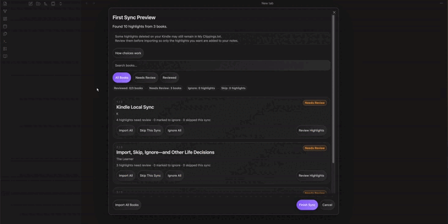

# Kindle Local Sync

將 Kindle 標註與筆記匯入 Obsidian，閱讀資料不會傳送到外部。

Kindle Local Sync 是僅適用於桌面端的 Obsidian 外掛。它會讀取透過 USB 連接的 Kindle 上的本機 `My Clippings.txt`，並把你核准的標註寫入資料庫中的 Markdown 筆記。

## 示範



## 功能

- 本機、USB-first 匯入，無需 Amazon 或 Readwise 帳號。
- 在 macOS、Windows 與 Linux 上自動偵測 Kindle 路徑，也支援手動路徑。
- 每本書一個 Markdown 筆記。
- 第一次同步和發現新標註時提供檢閱。
- 暫時 Skip 與持久化 Ignore 選擇。
- 儲存的同步資料遺失時，可重新連接既有 Kindle Local Sync 筆記。
- 已匯入標註在預期 Obsidian 筆記中遺失時，可進行復原檢閱。
- 保護外掛管理區塊之外的個人內容。
- 防止重複 clipping，並安全處理檔名。

## 語言

- [English](README.md)
- [Tiếng Việt](README.vi.md)
- [简体中文](README.zh-CN.md)
- [繁體中文](README.zh-TW.md)

## 從 Obsidian Community Plugins 安裝

外掛通過社群目錄審核後：

Settings → Community plugins → Browse → 搜尋 **Kindle Local Sync** → Install → Enable。

在此之前，僅在測試 beta 版本時使用 BRAT 或 GitHub Release ZIP。

## 快速開始

1. 用 USB 連接 Kindle。
2. 開啟 Obsidian 並啟用 **Kindle Local Sync**。
3. 如果沒有偵測到 Kindle，請在外掛設定中填寫 **My clippings.txt path**。
4. 選取 ribbon 中的書本圖示，或從 command palette 執行 **Sync local kindle highlights**。
5. 檢閱需要選擇的標註。
6. 選取 **Finish Sync**，然後開啟已設定的 highlights 資料夾查看結果。

## Kindle Local Sync 如何運作

1. 外掛從 Kindle 或你設定的本機路徑讀取 `My Clippings.txt`。
2. 它解析標註與筆記，略過 bookmark 與格式損壞的項目，並依書籍分組。
3. 需要檢閱時，你可以選擇 Import、僅本次 Skip 或 Ignore。
4. 在你選取 **Finish Sync** 前，檢閱中的選擇都不會套用。
5. 已核准的標註會寫入相符的 Obsidian 書籍筆記。只有已核准的 Import 確實需要時，才會建立新筆記。
6. 後續同步會比較目前 Kindle 檔案、已儲存的選擇，以及現有筆記中的外掛管理區塊。
7. 外掛管理區塊之外的個人內容會保留。

`My Clippings.txt` 是匯入來源，不是可靠的刪除記錄。某條標註未出現在目前 Kindle 檔案中，並不表示外掛可以自動刪除 Obsidian 中的副本。

## 新使用者

如果沒有可信的同步歷史，也沒有既有 Kindle Local Sync 筆記，第一次同步會開啟 **First Sync Preview**。每條標註一開始都沒有選擇，由你決定哪些內容進入 Obsidian。

- **Import**：完成同步時加入標註。
- **Skip This Sync**：本次不變更，下次可能再次出現。
- **Ignore**：在你從 Ignore 清單移除前，不再參與後續同步。

僅開啟檢閱或選擇暫時操作不會建立書籍筆記。外掛只會在 **Finish Sync** 後寫入內容並儲存選擇。未檢閱的標註會按本次暫時 Skip 處理，下次可能再次出現。

## 回訪使用者

### 有已儲存的同步歷史

當 `data.json` 包含可信的 Import 或 Ignore 歷史時，已匯入且 marker 仍存在的標註會自動重新整理；已 Ignore 的標註不參與同步。通常只有新標註，以及已匯入但在預期筆記中遺失的標註需要處理。

外掛不會把 `My Clippings.txt` 當作刪除 Obsidian 舊標註的授權。如果無法在保留現有 managed 內容的前提下安全重新整理某本書，外掛會保持該筆記不變，並在結果摘要中說明。

### 有現有筆記，但沒有可信的 `data.json`

如果已設定的 highlights 資料夾中存在有效 Kindle Local Sync managed 區塊，但缺少可信同步歷史，外掛會顯示 **Existing Kindle notes found**。

選取 **Continue with existing notes** 重新連接：

- 在預期書籍筆記中找到的精確 marker 會記錄為既有匯入。
- 無法相符的標註會進入 **Review New Highlights**。
- 現有筆記保持原位，managed 區塊之外的個人內容會保留。
- 僅憑 Markdown 無法復原舊 Ignore 選擇，因此外掛不會猜測。

因此，正常情況下你只需檢閱無法相符的標註，而不是重新核准所有舊標註。

### 從舊版本更新後

舊版本可能儲存了外掛設定，但沒有儲存標註歷史。更新後，你可能會看到 **Existing Kindle notes found**。選取 **Continue with existing notes** 重新連接：外掛會保留現有筆記，識別 marker 相符的標註，並且只要求你檢閱無法相符的標註。

如果沒有找到有效的現有 Kindle Local Sync 筆記，外掛會改用 **First Sync Preview**。

## 每個選擇的含義

| 選擇 | 實際行為 | 範例 |
| --- | --- | --- |
| **Import** | 暫時選取一條標註，在選取 **Finish Sync** 時寫入。 | 匯入專案筆記中要引用的一段話。 |
| **Skip This Sync** | 本次略過一條標註；在書籍卡片上使用時，會略過該書所有標註。下次可能再次出現。 | 把一段長文留到下次再決定。 |
| **Ignore** | 在 **Finish Sync** 後儲存持久 Ignore；從 Ignore 清單移除前不再參與後續同步。 | 隱藏無用 clipping。 |
| **Import All** | 把該書所有目前暫時選擇改為 Import。 | 匯入一本書的全部目前 clipping。 |
| **Ignore All** | 把該書所有目前暫時選擇改為 Ignore。 | 讓一本書的目前標註不再參與後續同步。 |
| **Import All Books** | 把目前檢閱中的所有選擇（包括被篩選隱藏的書）改為 Import。已有 Skip 或 Ignore 時會先確認；以前儲存的 Ignore 不受影響。 | 一次核准整個第一次檢閱。 |
| **Finish Sync** | 套用目前選擇、儲存已確認狀態，並開啟 **Sync complete** 或 **Sync finished**。未檢閱標註本次會被 Skip。 | 今天只檢閱關心的書後完成同步。 |
| **Cancel** | 沒有變更選擇時直接關閉；存在未儲存選擇時，詢問繼續檢閱或放棄。搜尋、篩選、捲動與導覽不會觸發該警告。 | 不儲存誤選並離開。 |

後執行的批次操作會覆蓋先前的暫時選擇。例如，先 Ignore 一條標註，再為該書選取 **Import All**，該書目前所有標註都會變為 Import。確認後，**Import All Books** 會對整個檢閱做同樣的事。任何檢閱選擇都不會在 **Finish Sync** 前儲存。

### 尋找和檢閱

- **Search books...** 依書名和作者搜尋，不變更選擇；它不會搜尋標註正文。
- **All Books**、**Needs Review** 與 **Reviewed** 只篩選書籍清單，並保留完整檢閱狀態。
- **How choices work** 與 `?` 按鈕顯示同一份簡短說明。
- **Review Highlights** 開啟某本書的逐條選擇。

## Sync Summary 和後續操作

同步完成後，摘要會報告 Import、Ignore、Skip、未檢閱、重複與 missing 的數量。依結果可能提供：

- **Review Skipped This Sync**：查看暫時 Skip。可以繼續暫時略過，也可以選取 **Ignore Going Forward**；書籍層級 **Ignore All Highlights** 需要確認。
- **Manage Ignored Highlights**：依書查看 Ignore 項目，使用 **Remove From Ignore List** 或 **Remove All From Ignore List**。移除 Ignore 不會立即重寫筆記；如果 clipping 仍在 `My Clippings.txt`，後續同步會按 new 或 missing 重新處理。
- **Review Missing Highlights**：處理以前已匯入、目前卻不在預期筆記中的標註。
- **View Books Left Unchanged**：查看因無法安全更新而保持不變的書籍。
- **Review Note Update Issues**：查看 Ignore 清理失敗或無法確認的結果。

## Missing Highlights

只有同時符合以下條件，標註才會被視為 missing：

1. 目前 `My Clippings.txt` 仍包含它。
2. `data.json` 中存在本次同步可信任的相符 imported-highlight 記錄。
3. 在預期書籍筆記路徑的有效 managed 區塊中找不到它的精確 marker。

此檢查在回訪使用者同步中、解析 Kindle 檔案後執行。如果無法安全讀取預期筆記，外掛不會自動把標註判定為 missing。

你可以為每條 missing 標註選擇：

- **Import Again**：嘗試復原。只有 writer 確認結果安全後，該項目才會從 missing 清單消失；否則仍可重試。
- **Ignore Going Forward**：儲存 Ignore 並讓它不再參與後續同步。舊 imported 記錄仍保留，但 Ignore 優先；以後移除 Ignore 且 marker 仍遺失時，它可能再次成為 missing。
- **Skip This Time**：只從目前摘要移除，不儲存任何決定，因此下次可能再次出現。

書籍層級對應操作為 **Import All Again**、**Ignore All Going Forward** 與 **Skip All This Time**。

限制：missing 偵測依賴已儲存的 imported metadata、目前檔案中仍有該 clipping、預期筆記路徑，以及可讀取的 managed 區塊。手動移動筆記可能產生 missing；如果標註同時從目前 Kindle 檔案與可信身分資料中消失，則無法檢查。

## 如果標註被刪除

### 從 Obsidian 筆記中刪除

如果你手動刪除外掛管理的標註，但 marker 結構與筆記其餘部分仍有效，那麼在已儲存 Import 記錄和 Kindle 檔案項目仍存在時，它會在下次同步出現在 **Missing Highlights**。刪除整個 managed 區塊可能使該筆記中所有受追蹤標註都顯示為 missing。

之後可以再次 Import、以後 Ignore，或本次 Skip。managed marker 之外的個人內容不屬於此檢查。

### 從 Kindle 刪除

Kindle Local Sync 沒有 Kindle 刪除 API，只能讀取 `My Clippings.txt`；Kindle 裝置可能繼續把已刪除標註保留在該檔案中。

- 如果標註已不在 `My Clippings.txt`，外掛不會把這種缺少視為刪除 Obsidian 副本的授權。
- 如果它仍在 `My Clippings.txt`，外掛仍會把它視為一般 clipping。依已儲存狀態和筆記，它可能被重新整理、檢閱、Ignore 或顯示為 missing。

因此，外掛無法保證偵測到 Kindle 裝置上的每一次刪除。

## 保護個人筆記

Kindle Local Sync 只管理以下 marker 之間的區塊：

```markdown
<!-- kindle-local-sync:start -->
<!-- kindle-local-sync:end -->
```

managed 區塊可能在同步時重新整理。請把個人內容放在 marker 之前或之後；marker 之外的內容會保留。

如果 marker 結構損壞，或更新會在沒有明確授權的情況下移除現有 managed 標註，外掛會讓該書筆記保持不變，而不會猜測。

## 重複處理

完全相同的 clipping 重複副本只寫入一次。新記錄使用完整 SHA-256 `kls2-...` 身分，因此不同 clipping 即使舊的 32 位元 `kls-...` ID 發生碰撞，也會保持獨立。

舊筆記與已儲存選擇只會在舊 ID 及其實體區塊或狀態唯一符合目前 clipping 後延遲遷移。如果同一本書內的舊 ID 有歧義，外掛會保持該書與已儲存決定不變，並在摘要中說明衝突；不相關書籍仍可繼續。

如果舊 collision 中目前只出現一則標註，外掛無法知道先前的 Import 或 Ignore 選擇實際指向哪一則。外掛會保留舊證據；如果第二則標註之後出現並讓衝突可見，該書筆記會保持不變並等待檢閱。

降級警告：`0.1.2` 及更早版本不具碰撞安全性，也不理解新的權威身分。請勿用舊版本重寫或清理由此版本寫入的筆記或狀態。

## 已知限制

存在歧義的舊版衝突會被安全隔離；引導式復原功能將延後提供。

## 隱私

所有標註處理都在本機完成。執行階段原始碼沒有網路請求、雲端同步、analytics、telemetry、Amazon API 或 Readwise API 路徑。外掛不會透過網路傳送標註文字或資料庫內容。

外掛從本機檔案系統讀取 `My Clippings.txt`，並在 Obsidian 資料庫內寫入 Markdown 和外掛狀態。**Strict local only** 設定會儲存，但目前執行階段即使變更該切換仍保持本機，因為不存在網路功能。

## 疑難排解

- **找不到 My Clippings.txt**：用 USB 連接 Kindle，然後手動填寫絕對 **My clippings.txt path**。
- **找不到標註**：確認檔案包含 Highlight 或 Note，而不只是 bookmark。
- **後續同步沒有變更**：相同的已匯入 marker 仍存在時，這是正常行為。
- **某本書保持不變**：外掛無法證明取代 managed 區塊是安全的。檢查 marker，並在編輯 managed 區塊前備份。
- **更新後出現 Existing Kindle notes found**：這是[從舊版本更新後](#從舊版本更新後)所述的正常重新連接步驟。現有筆記會保留。
- **個人內容在產生的筆記中**：將它移到 `kindle-local-sync` marker 之外，避免後續 managed 重新整理時被取代。

## 技術文件

架構、同步狀態、持久化、安全約束、已知限制以及原始碼/測試對照請參閱[技術架構](docs/ARCHITECTURE.md)。

## Roadmap

- 在乾淨資料庫中完成 new、returning、reconnect、missing、Ignore、Skip、cancel 和 managed-region 手動 QA。
- 以經驗證的隱私安全錄影取代目前 demo。
- 發行前驗證可重現、可安裝的 release artifact。
