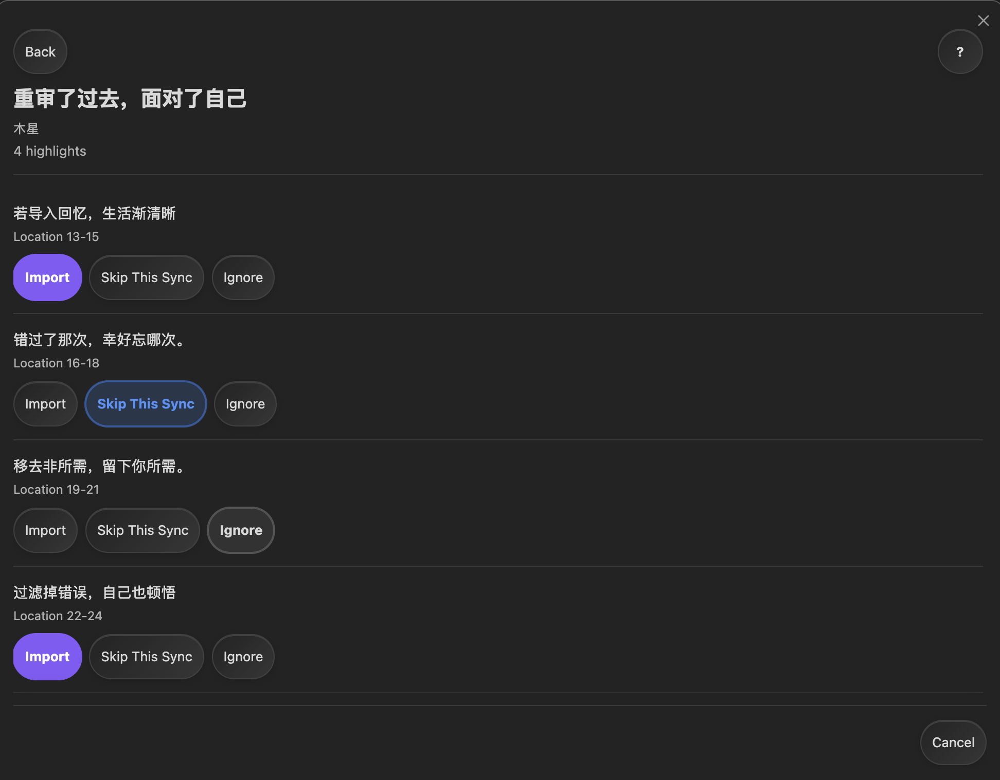
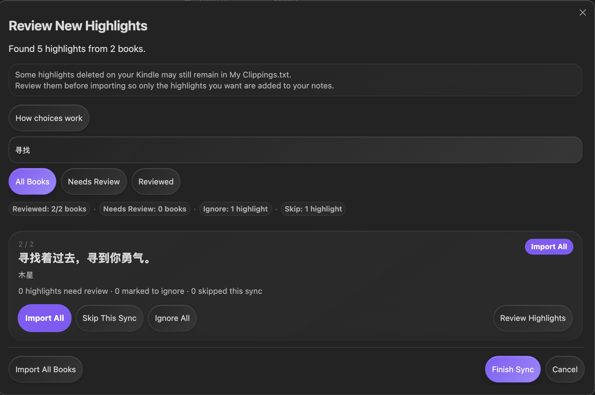

# Kindle Local Sync

將 Kindle 標註帶進 Obsidian，不必把閱讀資料傳送到任何地方。

Kindle Local Sync 是僅適用於桌面版的 Obsidian 外掛。它會讀取 Kindle 上本機的 `My Clippings.txt` 檔案，並為你選擇保留的標註建立整潔的 Markdown 筆記。

## 示範


## 📖 為什麼使用它？

- 將 Kindle 標註留在你實際使用的 Obsidian 筆記和專案旁。
- 在標註加入資料庫之前先檢閱新標註。
- 每本書使用一份 Markdown 筆記。
- 更新後或外掛資料遺失時，重新連結現有的 Kindle Local Sync 筆記。
- 將個人寫作與外掛更新的部分分開。

## 語言

- [English](README.md)
- [Tiếng Việt](README.vi.md)
- [简体中文](README.zh-CN.md)
- [繁體中文](README.zh-TW.md)

## 開始前需要準備

- 桌面版 Obsidian。
- 含有本機 `My Clippings.txt` 檔案的 Kindle；通常以 USB 連接 Kindle 後即可存取。
- 一個用來保存書籍筆記的 Obsidian 資料庫。

## 安裝

當外掛可在 Obsidian Community Plugins 中使用後：

1. 開啟 **Settings** → **Community plugins** → **Browse**。
2. 搜尋 **Kindle Local Sync**。
3. 選擇 **Install**，然後選擇 **Enable**。

如需測試 beta 版本，僅在你主動測試預發布建置時使用 BRAT 或 GitHub Release ZIP。

## 🧭 快速開始

1. 以 USB 連接 Kindle。
2. 在外掛設定中確認 **My clippings.txt path**。如果沒有偵測到 Kindle，請自行選擇本機 `My Clippings.txt` 檔案。
3. 為 Markdown 筆記選擇 **Highlights folder**。
4. 從命令面板執行 **Sync local kindle highlights**，或使用功能區中的書本圖示。
5. 檢閱需要選擇的標註，然後選擇 **Finish Sync**。

外掛會讀取檔案、依書籍分組標註，並將已核准的標註寫入所選資料夾。只有核准的匯入確實需要時，才會建立筆記。

## 同步時會發生什麼

首次同步時，**First Sync Preview** 會讓你決定哪些標註要進入 Obsidian。之後的同步通常會辨識已匯入的標註，只詢問新的或遺失的項目。

| 選擇 | 現在會發生什麼 | 下次同步會發生什麼 |
| --- | --- | --- |
| **Import** | 選擇 **Finish Sync** 後新增所選標註。 | 它們會被辨識為已匯入。 |
| **Skip This Sync** | 今天不新增該標註。 | 它可能再次出現供你檢閱。 |
| **Ignore** | 不匯入該標註。 | 它會保持忽略狀態，直到你從 Ignore 清單中移除它。 |



檢閱較多項目時，也可以使用 **Import All**、**Ignore All** 或 **Import All Books**。在選擇 **Finish Sync** 前，所有檢閱選擇都只是暫時的。

使用搜尋和檢閱篩選器可以快速找到一本書。



如果標註之後從 `My Clippings.txt` 中消失，外掛不會將此視為刪除 Obsidian 副本的許可。Kindle 裝置可能仍會在該檔案中保留已刪除的標註，因此外掛不能把它當作可靠的刪除清單。

## 現有 Kindle 筆記

如果你已有 Kindle Local Sync 筆記，但外掛找不到儲存的歷史記錄，它會顯示 **Existing Kindle notes found**。

選擇 **Continue with existing notes** 來重新連結。外掛會保留這些筆記、辨識可以比對的標註，並只要求你檢閱無法比對的項目。你不需要重新核准每一條舊標註。

如果先前匯入的標註不再出現在預期筆記中，**Missing Highlights** 可以提供 **Import Again**、**Ignore Going Forward** 或 **Skip This Time**。如果外掛無法安全檢查筆記，它會保持該書不變，並在同步摘要中說明原因。

## 保護個人筆記

Kindle Local Sync 只更新它在以下標記之間建立的部分：

```markdown
<!-- kindle-local-sync:start -->
<!-- kindle-local-sync:end -->
```

請將自己的文字放在這個部分之前或之後。標記外的內容會被保留。如果外掛無法安全更新書籍筆記，它會保持筆記不變，而不是猜測如何處理。

## 🔒 隱私

你的標註始終留在本機。Kindle Local Sync 從電腦讀取 `My Clippings.txt`，並在資料庫中寫入 Markdown 筆記和外掛設定。它不會上傳你的標註或資料庫內容，也沒有雲端同步、遙測、Amazon 或 Readwise 連線。

## 🛠️ 疑難排解

| 你看到的情況 | 通常表示什麼 | 可以嘗試什麼 |
| --- | --- | --- |
| **Could not find My Clippings.txt** | 未偵測到 Kindle，或檔案路徑已改變。 | 連接 Kindle，然後手動設定 **My clippings.txt path**。 |
| 找不到標註 | 檔案可能只有書籤或不支援的項目。 | 檢查檔案是否包含 Kindle Highlight 或 Note 項目。 |
| 後續同步沒有變化 | 相同標註已被辨識。 | 這是正常情況；新標註會提供給你檢閱。 |
| 一本書保持不變 | 外掛無法證明更新它是安全的。 | 保留備份，檢查外掛區域，解決筆記問題後再試。 |
| **Existing Kindle notes found** | 找到了現有筆記，但沒有可用的儲存歷史。 | 選擇 **Continue with existing notes** 重新連結。 |

## 進階文件和支援

- [技術架構](docs/ARCHITECTURE.md)為維護者和進階使用者說明同步行為、遷移、相容性和安全規則。
- [發行清單](docs/release-checklist.md)涵蓋測試和發行工作。
- [Support](SUPPORT.md)說明如何在不分享私人閱讀資料的情況下回報問題。

Kindle Local Sync 依 [MIT License](LICENSE) 發行。
