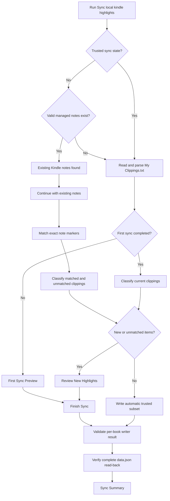
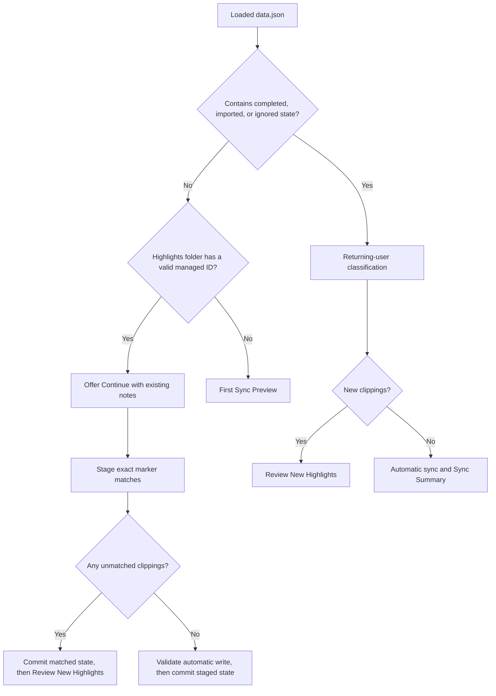
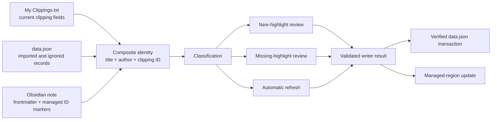

# Kindle Local Sync technical architecture

This document describes the behavior implemented in the current repository. It is intended for maintainers and release reviewers; the [main README](../README.md) remains the user guide.

## Scope and trust model

Kindle Local Sync is a local-only Obsidian desktop plugin. Its three sources of truth have different authority:

- `My Clippings.txt` says which clippings are available as current import input. It is not deletion authority.
- plugin `data.json` records configuration, completed review state, imported identities, and Ignore choices;
- Obsidian Markdown shows the physical note state and whether a managed highlight marker is still present.

A sync action is trusted only when the relevant identity, note ownership, managed-region structure, writer result, and settings persistence can be confirmed. Uncertainty should preserve existing content and keep work reviewable.

## Overall sync flow



Primary orchestration: [`src/main.ts`](../src/main.ts), especially `syncHighlights()`, `syncExistingHighlights()`, `completeFirstSync()`, `completeReviewedSync()`, and `continueExistingNotesWithoutDataSync()`.

## Main components

| Component | Responsibility |
| --- | --- |
| [`src/main.ts`](../src/main.ts) | Orchestrates detection, parsing, user-state routing, review completion, writer validation, verified persistence, reconnect, Ignore cleanup, and summary creation. |
| [`src/parser/parseClippings.ts`](../src/parser/parseClippings.ts) | Parses Kindle blocks into `KindleHighlight`; skips bookmarks, empty content, and malformed blocks. |
| [`src/FirstSyncPreviewModal.ts`](../src/FirstSyncPreviewModal.ts) | First-sync and incremental-review choices, book search/filtering, bulk precedence, unsaved-choice guard, completion retry. |
| [`src/ExistingNotesWithoutDataModal.ts`](../src/ExistingNotesWithoutDataModal.ts) | Offers `Continue with existing notes` and in-place retry when managed notes exist without trusted state. |
| [`src/sync/SyncClassifier.ts`](../src/sync/SyncClassifier.ts) | Classifies each unique current clipping as new, duplicate/present, ignored, or imported-but-missing. |
| [`src/sync/VaultHighlightLookup.ts`](../src/sync/VaultHighlightLookup.ts) | Checks for an exact clipping marker in the deterministic expected book note and valid managed region. |
| [`src/sync/VaultWriter.ts`](../src/sync/VaultWriter.ts) | Allocates note paths, deduplicates within books, creates notes, safely refreshes managed regions, and returns per-book outcomes. |
| [`src/sync/ManagedRegion.ts`](../src/sync/ManagedRegion.ts) | Classifies marker structure and extracts valid managed highlight IDs. |
| [`src/sync/VaultWriteContract.ts`](../src/sync/VaultWriteContract.ts) | Runtime-validates the complete writer summary before it authorizes imported state or counts. |
| [`src/sync/IgnoredHighlightCleanup.ts`](../src/sync/IgnoredHighlightCleanup.ts) | Attempts exact-book, exact-block removal after an Ignore decision is durably saved. |
| [`src/SyncSummaryModal.ts`](../src/SyncSummaryModal.ts) | Reports results and hosts missing, skipped, ignored, protected-book, and cleanup-recovery views. |
| [`src/IgnoredHighlightsModal.ts`](../src/IgnoredHighlightsModal.ts) | Manages persisted Ignore records from the command palette. |
| [`src/settings.ts`](../src/settings.ts) | Defines settings/state and backward-compatible migration defaults. |

## User-state decision flow



`containsTrustedSyncState()` treats any of these as trusted: `hasCompletedFirstSync`, at least one imported record, or at least one ignored record. A current incomplete snapshot with all three empty/false remains untrusted. Legacy settings-only input is normalized to that same untrusted routing state while retaining its supported settings.

## Data relationships



The relationship is intentionally not a two-way mirror. Absence from `My Clippings.txt` does not delete Markdown or imported history. Markdown alone cannot reconstruct a past Ignore decision.

## Sync lifecycle

1. `syncHighlights()` checks whether trusted state exists and whether valid managed-note evidence requires reconnect.
2. `readDetectedHighlights()` detects the local path, reads UTF-8 text, parses clippings, and stops with a user notice when the file or usable content is missing.
3. `CurrentClippingIdentityIndex` is built from the complete current input so legacy authorless records are resolved conservatively.
4. Highlights are grouped by exact `(bookTitle, author)`.
5. The plugin routes to first review, reconnect, incremental review, or automatic sync.
6. Reviewed Import choices and automatic imported history are combined by composite identity. Ignore and Skip are not included in ordinary output.
7. `writeBookNotesToVault()` returns ordered per-book `created`, `updated`, `confirmed`, or `protected` outcomes.
8. `validateAndPartitionVaultWriteSummary()` validates the entire result and partitions safely completed versus protected highlights.
9. High-risk settings are proposed from the latest confirmed live state, JSON-normalized, saved, loaded again, and compared canonically. Live state changes only after an exact read-back match.
10. Persisted Ignore decisions are followed by a separate best-effort exact-block cleanup.
11. `SyncSummaryModal` reports confirmed counts and any recovery work.

## Behavior matrix

| Scenario | Actual route | Review and write behavior | Persistent effect |
| --- | --- | --- | --- |
| 1. No plugin data and no valid managed notes | `First Sync Preview` | Every detected clipping requires Import, Skip, Ignore, or remains unreviewed until `Finish Sync`. | Safe Imports, Ignore choices, and `hasCompletedFirstSync` are saved together after writer validation. |
| 2. No plugin data plus valid managed notes | `Existing Kindle notes found` | `Continue with existing notes` stages exact expected-path marker matches; unmatched items are reviewed. | Only physically confirmed matches are reconstructed. Ignore history is not inferred. |
| 3. Legacy settings-only data plus valid managed notes | `Existing Kindle notes found` | Uses the preserved legacy highlights folder; exact marker matches reconnect and only unmatched items enter `Review New Highlights`. | Settings remain unchanged; successful reconnect persists a full current-format snapshot. |
| 4. Legacy settings-only data without valid managed notes | `First Sync Preview` | Legacy settings are retained, but no sync completion or history is trusted. | The full current-format state is persisted only after successful completion. |
| 5. Valid current-format completed state, including empty history arrays | Returning-user classification | Present imports refresh automatically; new items use `Review New Highlights`; missing imports appear in summary. | New confirmed decisions append authored records; previous history remains. |
| 6. Valid current-format incomplete state plus valid managed notes | `Existing Kindle notes found` | Uses the existing reconnect flow. | Same verified reconstruction rules as other reconnect cases. |
| 7. Valid current-format incomplete state without valid managed notes | `First Sync Preview` | No note ownership is inferred. | Completion persists through the verified transaction boundary. |
| 8. Managed highlight deleted from an Obsidian note | Possible `Missing Highlights` | Requires current clipping, trusted imported record, expected note lookup, and absent marker. No automatic restore. | Import Again confirms/restores; Ignore adds an ignored record; Skip saves nothing. |
| 9. Highlight deleted on Kindle and removed from current file | No item to classify | Existing note is not deletion-targeted. A partially represented book may be protected from replacement; a book with no outgoing group is untouched. | No automatic deletion or imported-history removal. |
| 10. Kindle deletion remains in `My Clippings.txt` | Normal current clipping | The plugin cannot distinguish it from a retained clipping. Its saved/note state determines automatic, new, ignored, or missing behavior. | No special Kindle-deletion state exists. |
| 11. `Skip This Sync` | Temporary review decision | Excluded from the current write and shown in `Review Skipped This Sync`; unreviewed items use the same one-sync return behavior. | Nothing is written to `data.json` for the Skip. |
| 12. `Ignore` | Temporary until `Finish Sync`, then persistent | Excluded from future classification. After durable save, exact-note cleanup is attempted and separately reported. | Adds composite ignored record; imported record, if any, is not removed. |
| 13. Individual Skip/Ignore followed by a book bulk action | Later bulk action wins | `Import All`, `Skip This Sync`, or `Ignore All` rewrites every current choice in that book. `Import All Books` rewrites all current review choices after confirmation when needed. | Only the final live choices at `Finish Sync` are saved. Previously persisted Ignore records are not mutated by `Import All Books`. |

## Review choices and precedence

`FirstSyncPreviewModal` stores temporary choices in a `Map` keyed by composite highlight identity.

- Per-highlight labels are `Import`, `Skip This Sync`, and `Ignore`.
- Book labels are `Import All`, `Skip This Sync`, and `Ignore All`.
- `setGroupChoice()` assigns the selected value to every clipping in the book, overwriting earlier individual choices.
- `Import All Books` operates on the complete review model, including books hidden by search/filter. If a current Skip or Ignore exists, it shows a confirmation explaining that those temporary choices become Import.
- The global bulk action is disabled after an invalid writer contract has independently and durably saved Ignore choices, preventing a temporary rerender from reversing already persisted authority.
- `Finish Sync` with undecided highlights shows a confirmation; undecided items become `returnReason: "unreviewed"` and are not persisted.
- Search matches title variants and author case-insensitively. Filters use `All Books`, `Needs Review`, and `Reviewed`. Neither changes dirty state.
- `close()` covers Cancel, native close, and Escape-style close requests. A real unsaved decision opens `Discard your selections?`; navigation/search/filter/scroll alone closes directly.

Tests: [`src/FirstSyncPreviewModal.test.ts`](../src/FirstSyncPreviewModal.test.ts), including `orders per-highlight buttons as Import, Skip This Sync, Ignore`, `filters All Books, Needs Review, and Reviewed books`, `changes every current modal choice to Import only after confirmation`, `passes the final live choices to Finish Sync after later individual edits`, and `uses the same guard for native close and Escape-style close requests`.

## Classification

`classifyHighlightsForSync()` processes the complete current input in order and deduplicates repeated composite identities during classification.

| Classification | Condition | Next behavior |
| --- | --- | --- |
| `ignoredHighlights` | Trusted ignored identity matches. | Kept out of automatic and new review. |
| `newHighlights` | Neither trusted ignored nor imported identity matches. | Shown in first/incremental review. |
| `duplicateHighlights` | Same input identity already seen, or imported marker is present. | No new review; imported present items may be in the automatic refresh subset. |
| `possibleReappearedHighlights` | Trusted imported identity matches but expected valid managed region lacks its marker. | Shown as `Missing Highlights` in the summary. |

If note lookup throws because managed ownership is unsafe or the read fails, classification falls back to duplicate/present rather than claiming the highlight is missing. This avoids authorizing a recovery rewrite based on unreadable state.

Tests: [`src/sync/SyncClassifier.test.ts`](../src/sync/SyncClassifier.test.ts) and [`src/sync/VaultHighlightLookup.test.ts`](../src/sync/VaultHighlightLookup.test.ts).

## New-user flow

`migrateSettings(null)` sets `hasCompletedFirstSync` to false. With no managed-note evidence, `syncHighlights()` opens `First Sync Preview` before any note write.

On `Finish Sync`:

- Import choices go through the writer and full runtime validation;
- only safely completed explicit Imports become imported records and count as newly imported;
- Ignore choices are included in the same verified final settings snapshot;
- Skip and unreviewed items are passed only to the current summary;
- `hasCompletedFirstSync` becomes true only after exact durable read-back;
- Ignore cleanup runs after confirmed persistence.

If the writer or settings transaction fails, the review remains open with choices intact and a retry action. A physical note may have changed before settings verification fails, so failure copy deliberately says that some note changes may have occurred.

Tests: [`src/main.sync-review.test.ts`](../src/main.sync-review.test.ts), including `opens review before importing on first sync`, `uses the actual safe count for first sync and does not inflate duplicate selections`, and persistence/retry cases; [`src/FirstSyncPreviewModal.test.ts`](../src/FirstSyncPreviewModal.test.ts) covers review behavior.

## Returning-user flow

When trusted state exists, classification compares current clippings with saved imported/ignored identities and exact managed markers.

`getReviewedHighlightsForAutomaticSync()` includes only current highlights that are trusted imported, not ignored, and not classified missing. If new highlights exist, the plugin opens `Review New Highlights`; after `Finish Sync`, automatic history and explicit Imports are written together. Otherwise the automatic subset is written directly and a summary opens.

Ordinary sync never deletes imported records merely because their clipping disappeared from current input. Books absent from all outgoing groups are untouched. When a partially represented outgoing group omits an existing managed ID, the writer protects the entire book.

Tests: [`src/main.sync-review.test.ts`](../src/main.sync-review.test.ts), including `does not force review or duplicate state when a later sync has no new highlights`, `opens review only for newly detected later-sync highlights`, and `keeps ignored highlights out of later-sync review and automatic import`.

## Existing Markdown without trusted data

`hasExistingHighlightNotes()` looks at Markdown files directly inside the configured highlights folder. At least one valid managed region containing a parseable Kindle Local Sync ID is required. Marker-free, malformed, empty, unreadable, or ID-shaped comments outside the managed region are not trusted evidence.

`Continue with existing notes`:

1. reads current clippings and allocates the same deterministic paths used by the writer;
2. checks exact composite identities and markers at those paths;
3. stages confirmed matches as imported records;
4. classifies unmatched items as new;
5. commits staged matches through verified persistence before opening incremental review, or after safe automatic validation when no review is needed.

Verified reconnect state and unfinished incremental-review choices have separate transaction boundaries. Cancel/Discard removes only modal-local Import, Skip, and Ignore choices; it does not roll back already verified matched-highlight records. The next sync therefore stays on the returning-user path without reconnecting again, while unmatched highlights return to `Review New Highlights`.

A previous Ignore cannot be reconstructed because an absent Markdown block is ambiguous. Manually moved or renamed notes may fail expected-path matching and enter review.

Tests: [`src/ExistingNotesWithoutDataModal.test.ts`](../src/ExistingNotesWithoutDataModal.test.ts), [`src/sync/ExistingHighlightNotes.test.ts`](../src/sync/ExistingHighlightNotes.test.ts), and reconnect cases in [`src/main.sync-review.test.ts`](../src/main.sync-review.test.ts).

## Missing managed highlight detection

The user-facing label is `Missing Highlights`. The underlying collection is `possibleReappearedHighlights`.

### Exact detection rule

A current highlight enters the collection only when:

- a trusted imported identity exists in `data.json`;
- no trusted Ignore identity takes precedence;
- the clipping is present in the current parsed file;
- `createVaultHighlightLookup()` finds the deterministic expected note path but does not find the exact ID inside a valid managed region, or the expected file/path is absent.

Manually deleting a managed clipping block therefore triggers missing review when the remaining prerequisites hold. Removing the whole managed region returns false for every matching imported current clipping. If `data.json` is missing, reconnect treats the clipping as unmatched/new, not missing.

### When it runs

The check runs during returning-user classification on each sync. It cannot examine a Kindle deletion that is absent from current input.

### Choices and state effects

| Choice | Note effect | State effect | If attempted operation fails |
| --- | --- | --- | --- |
| `Import Again` | Rewrites the complete safe same-book proposal, including automatic current history plus selected missing items. | Explicit missing items are persisted only after validated safe completion. Existing imported records are not duplicated. | Item remains visible and retryable; protected and uncertain failures are distinguished. |
| `Ignore Going Forward` | After durable Ignore save, exact-block cleanup is attempted; for an already absent block this usually reports no matching block. | Adds ignored record; imported record remains. | Durable Ignore still governs future sync; cleanup problem is reported separately. |
| `Skip This Time` | No write. | No persistent change; item is removed only from the live summary. | It can return next sync. |

Book-level actions scope only the currently missing items of that exact `(title, author)` book. Tests in [`src/SyncSummaryModal.test.ts`](../src/SyncSummaryModal.test.ts) cover grouping, scoping, retry, partial/invalid writer results, persistence, and navigation. Orchestration regressions are in [`src/main.sync-review.test.ts`](../src/main.sync-review.test.ts).

### Limitations

- A clipping must still be in the current file.
- Trusted imported metadata is required.
- Note lookup is path-based; moved/renamed notes can look missing.
- Unsafe or unreadable managed regions fail closed as duplicate/present rather than missing.
- Kindle may keep device-deleted highlights in `My Clippings.txt`, so no device-deletion inference is possible.

## Ignored and skipped highlights

Skip is modal-local. Explicit Skip and unreviewed items appear in the current summary and may return on the next sync. `Review Skipped This Sync` can convert one item to `Ignore Going Forward` or, after confirmation, all current skipped items in one book to `Ignore All Highlights`.

Ignore has two separate outcomes:

1. a durable ignored identity controls future classification;
2. exact-block cleanup tries to remove a matching generated block from exactly one frontmatter-owned book note.

Cleanup can report removed, note not found, already absent, ambiguous ownership, unsafe region, failed write, or unknown final state. Persistence is not proof that cleanup succeeded. Removing an Ignore deletes one exact stored ignored record but does not automatically restore Markdown.

Tests: [`src/sync/IgnoredHighlightCleanup.test.ts`](../src/sync/IgnoredHighlightCleanup.test.ts), [`src/main.ignored-cleanup.test.ts`](../src/main.ignored-cleanup.test.ts), [`src/IgnoredHighlightsModal.test.ts`](../src/IgnoredHighlightsModal.test.ts), and the skipped/ignored sections of [`src/SyncSummaryModal.test.ts`](../src/SyncSummaryModal.test.ts).

## Persistent state in `data.json`

`KindleSyncSettings` stores:

| Field | Meaning |
| --- | --- |
| `clippingsPath` | Optional manually configured local path. |
| `highlightsFolder` | Vault-relative output folder. |
| `strictLocalOnly` | Stored UI setting; there is currently no network behavior to enable or disable. |
| `skipIgnoredHighlights` | Retained setting field; current classification always honors trusted ignored identities. |
| `hasCompletedFirstSync` | Routes new versus returning review behavior. |
| `importedHighlights[]` | `id`, `title`, optional legacy `author`, preview, and `importedAt`. |
| `ignoredHighlights[]` | `id`, `title`, optional legacy `author`, preview, `ignoredAt`, and optional `lang`. |

### Verified transaction boundary

`persistSettingsMutation()` serializes mutations through `settingsMutationQueue`:

1. create from latest confirmed live settings;
2. deep-clone record arrays at the caller boundary;
3. JSON-round-trip normalize and validate the complete proposed shape;
4. call Obsidian `saveData()` once;
5. call fresh `loadData()`;
6. normalize and compare complete canonical JSON, ignoring object key order but preserving arrays and values;
7. update live settings and trusted-state flags only on exact match.

This exists because `saveData()` promise fulfillment alone does not prove that `data.json` was physically updated. The transaction does not roll back a note write that happened before settings verification; retry paths and idempotent writer behavior contain that risk.

Tests: the persistence block in [`src/main.sync-review.test.ts`](../src/main.sync-review.test.ts) and [`src/main.test.ts`](../src/main.test.ts).

## Identity and duplicate handling

`createClippingId()` hashes trimmed title, author, type, location, date, and content using 32-bit FNV-1a, then encodes base 36 as `kls-...`.

Three scopes are used:

- book: exact `[title, author]`;
- current/authored highlight: exact `[title, author, id]`;
- legacy authorless lookup: `[title, id]`, resolved only through the complete current input.

Duplicate current clippings with the same ID inside one book are collapsed before writing. Composite identity prevents a raw-ID collision in different books from sharing import, Ignore, lookup, or cleanup state.

Legacy records without `author` are preserved byte-for-byte and in order. They are trusted for one sync only when the complete current input resolves exactly one distinct authored candidate. An explicit later Import or Ignore appends an authored record without rewriting legacy history.

Tests: [`src/sync/HighlightIdentity.test.ts`](../src/sync/HighlightIdentity.test.ts), [`src/render/renderMarkdown.test.ts`](../src/render/renderMarkdown.test.ts), [`src/settings.test.ts`](../src/settings.test.ts), and collision regressions across classifier, lookup, writer, cleanup, and orchestration suites.

## Managed-region ownership and update rules

Managed content is bounded by:

```markdown
<!-- kindle-local-sync:start -->
<!-- kindle-local-sync:end -->
```

Generated clipping blocks contain `<!-- kindle-local-sync-id: kls-... -->` markers.

`analyzeManagedRegion()` classifies:

- no markers;
- one valid empty/whitespace region;
- one valid region with parseable IDs;
- unsafe start-only, end-only, reversed, nested, duplicate, ambiguous, or nonempty-unparseable content.

For an existing valid region with IDs, `prepareSafeManagedRegionUpdate()` requires every existing ID to be present in the proposed book group. If any is missing, it returns `protected/existing-highlights-not-retained`. Unsafe structures return `protected/unsafe-existing-managed-region`. Protected notes receive no write.

When no markers exist, every existing byte is treated as personal content and the new managed section is appended. With valid markers and complete retained IDs, only the managed region is replaced. Content outside the region is preserved.

Tests: [`src/sync/ManagedRegion.test.ts`](../src/sync/ManagedRegion.test.ts), [`src/sync/VaultWriter.test.ts`](../src/sync/VaultWriter.test.ts), and [`src/render/renderMarkdown.test.ts`](../src/render/renderMarkdown.test.ts).

## Migration behavior

`migrateSettings()` merges defaults without rewriting existing arrays.

- `null` data: first sync remains incomplete;
- saved data with explicit `hasCompletedFirstSync`: that value is retained, defaulting false if undefined;
- legacy settings-only data from releases `0.1.0`–`0.1.2`: absence of `hasCompletedFirstSync`, `importedHighlights`, and `ignoredHighlights` keeps sync incomplete and untrusted while preserving `clippingsPath`, `highlightsFolder`, `strictLocalOnly`, and any other supported setting present;
- older saved state with an imported- or ignored-history field but no completion field retains the prior completed-state compatibility behavior. Recognition uses field presence, not array length;
- missing imported/ignored arrays become empty arrays;
- legacy authorless records remain unchanged and use conservative per-sync identity resolution.

No schema version is added for this fix. The explicit completion field already distinguishes current completed/incomplete snapshots, including completed users with empty history arrays. Adding a version would expand validation and persistence migration scope without improving this legacy decision.

After legacy reconnect, only clipping IDs found inside valid managed regions at deterministic expected note paths become imported records. Successful reconnect or First Sync completion writes the complete current shape through the verified transaction boundary; after restart, `hasCompletedFirstSync: true` routes the user through normal returning-user sync.

Regression coverage: [`src/settings.test.ts`](../src/settings.test.ts) and [`src/main.legacy-settings-migration.test.ts`](../src/main.legacy-settings-migration.test.ts).

## Error and cancellation behavior

- Missing path or no usable clippings stops before review/write and shows a Notice.
- Automatic sync orchestration catches errors and shows only `Kindle sync wasn’t completed. Please try again.`
- First/incremental review failures stay in context, retain choices/search/filter/scroll, lock duplicate requests while pending, and support `Try again`.
- Only an `InvalidVaultWriteContractError` with independently verified Ignore persistence may say Ignore choices were saved; ordinary I/O or uncertainty does not.
- Reconnect remains open during failure and supports an in-place retry.
- Missing Import Again failures stay visible, retryable, and do not increment counts without validated completion.
- Recovery persistence mutations are serialized in the summary.
- Cancel/native close/Escape discard protection applies only to actual temporary decision changes.

Runtime writer validation rejects missing, extra, duplicate, conflicting, reordered, wrong-identity/path/status/reason/ID, sparse-array, or aggregate-inconsistent results. It prevents malformed results from authorizing settings, but cannot roll back filesystem changes made before the result was returned.

## Local-only behavior

Runtime source imports only local parsing, filesystem/vault, settings, and Obsidian UI paths. A repository search finds no `fetch`, `requestUrl`, `XMLHttpRequest`, WebSocket, analytics, telemetry, Amazon API, Readwise API, or external sync call in `src/`.

`ClippingsReader` uses local file reading; the writer writes only through the Obsidian vault/adapter. There is no dedicated automated “no network” test, so privacy verification currently relies on source/dependency review and manual artifact inspection.

## Safety invariants

1. `My Clippings.txt` is import input, not deletion authority.
2. Personal content outside managed markers is preserved.
3. New users review before first import.
4. Existing users with reconstructable state should review only new, missing, or unmatched highlights.
5. Unsafe or ambiguous Markdown is not rewritten.
6. A protected book does not authorize imported state or inflate counts.
7. One protected book should not block unrelated safe books.
8. Ignore persistence and physical note cleanup are separate outcomes.
9. Exact book and highlight identity scope all stateful actions.
10. Runtime writer results are validated completely before downstream trust.
11. High-risk live settings change only after durable full-state read-back matches.
12. Errors must not claim success or unchanged physical state when the result is uncertain.

## Known limitations and blockers

### High: same-book 32-bit clipping-ID collision

Two distinct clippings within the same exact `(title, author)` can share the 32-bit ID. In-book deduplication and on-disk markers then collapse them or make exact cleanup ambiguous. Cross-book collisions are covered; same-book collisions are not solved.

### High: release artifacts are stale

The ignored `release/` artifacts present during the audit are from May 2026 and do not match the current source/style bundle. They cannot be used as a release candidate. Packaging must be recreated and verified from the exact intended commit without adding generated artifacts to source control.

### Medium: path-based note matching

Reconnect and missing detection use deterministic expected paths. Manually renamed or moved notes are not searched globally for safe automatic ownership and may become unmatched/missing.

### Medium: no authoritative Kindle deletion signal

Deleted Kindle highlights may remain in `My Clippings.txt`; absent clippings are not deletion authority. Device deletions cannot be reliably detected.

### Medium: manual UI and real-vault coverage remains incomplete

Automated tests cover DOM/state contracts extensively, but real Obsidian themes, focus appearance, narrow/translated layouts, managed-region real-vault cases, clean new-user and upgrade scenarios, and installable artifacts still require manual release QA.

### Low: stored configuration fields are not active branches

`strictLocalOnly` and `skipIgnoredHighlights` are stored, but the runtime has no network path and classification always honors ignored identities. Their names suggest switches that currently do not change those behaviors.

## Source and test map

| Major behavior | Source evidence | Test evidence |
| --- | --- | --- |
| First-sync review and choices | [`src/main.ts`](../src/main.ts), [`src/FirstSyncPreviewModal.ts`](../src/FirstSyncPreviewModal.ts) | [`src/main.sync-review.test.ts`](../src/main.sync-review.test.ts), [`src/FirstSyncPreviewModal.test.ts`](../src/FirstSyncPreviewModal.test.ts) |
| Returning-user automatic/new flow | `syncExistingHighlights()`, `getReviewedHighlightsForAutomaticSync()` | `does not force review...`, `opens review only for newly detected...`, `keeps ignored highlights out...` in [`src/main.sync-review.test.ts`](../src/main.sync-review.test.ts) |
| Existing notes without trusted state and legacy settings-only migration | [`src/settings.ts`](../src/settings.ts), [`src/sync/ExistingHighlightNotes.ts`](../src/sync/ExistingHighlightNotes.ts), [`src/ExistingNotesWithoutDataModal.ts`](../src/ExistingNotesWithoutDataModal.ts), reconnect orchestration | [`src/settings.test.ts`](../src/settings.test.ts), [`src/main.legacy-settings-migration.test.ts`](../src/main.legacy-settings-migration.test.ts), [`src/sync/ExistingHighlightNotes.test.ts`](../src/sync/ExistingHighlightNotes.test.ts), [`src/ExistingNotesWithoutDataModal.test.ts`](../src/ExistingNotesWithoutDataModal.test.ts) |
| Search, filters, bulk precedence, Cancel | [`src/FirstSyncPreviewModal.ts`](../src/FirstSyncPreviewModal.ts) | [`src/FirstSyncPreviewModal.test.ts`](../src/FirstSyncPreviewModal.test.ts) |
| Sync Summary, skipped, ignored management | [`src/SyncSummaryModal.ts`](../src/SyncSummaryModal.ts), [`src/IgnoredHighlightsModal.ts`](../src/IgnoredHighlightsModal.ts) | [`src/SyncSummaryModal.test.ts`](../src/SyncSummaryModal.test.ts), [`src/IgnoredHighlightsModal.test.ts`](../src/IgnoredHighlightsModal.test.ts) |
| Missing managed highlights | classifier, lookup, summary recovery, `importHighlights()` | [`src/sync/SyncClassifier.test.ts`](../src/sync/SyncClassifier.test.ts), [`src/sync/VaultHighlightLookup.test.ts`](../src/sync/VaultHighlightLookup.test.ts), missing sections of summary/orchestration tests |
| Managed-region preservation | [`src/sync/ManagedRegion.ts`](../src/sync/ManagedRegion.ts), [`src/sync/VaultWriter.ts`](../src/sync/VaultWriter.ts), [`src/render/renderMarkdown.ts`](../src/render/renderMarkdown.ts) | corresponding `ManagedRegion`, `VaultWriter`, and `renderMarkdown` suites |
| Ignore cleanup | [`src/sync/IgnoredHighlightCleanup.ts`](../src/sync/IgnoredHighlightCleanup.ts) | [`src/sync/IgnoredHighlightCleanup.test.ts`](../src/sync/IgnoredHighlightCleanup.test.ts), [`src/main.ignored-cleanup.test.ts`](../src/main.ignored-cleanup.test.ts) |
| Identity, duplicates, legacy records | [`src/sync/HighlightIdentity.ts`](../src/sync/HighlightIdentity.ts), `dedupeClippings()`, [`src/settings.ts`](../src/settings.ts) | identity, classifier, render, settings, lookup, cleanup, writer, and orchestration suites |
| Writer-result validation | [`src/sync/VaultWriteContract.ts`](../src/sync/VaultWriteContract.ts) | [`src/sync/VaultWriteContract.test.ts`](../src/sync/VaultWriteContract.test.ts), invalid-contract integration tests |
| Verified persistence and retries | `persistSettingsMutation()` and recovery orchestration in [`src/main.ts`](../src/main.ts) | persistence blocks in [`src/main.sync-review.test.ts`](../src/main.sync-review.test.ts) and [`src/main.test.ts`](../src/main.test.ts) |
| Local-only behavior | local-only runtime source scan; [`src/sync/ClippingsReader.ts`](../src/sync/ClippingsReader.ts) | No dedicated network-prohibition test; parser/reader/writer tests exercise local paths. |

## Release verification implications

Automated checks are necessary but do not close the release gate. The exact intended release commit must pass Node 20/22 CI, full local tests, direct TypeScript, lint, a disposable clean production build, packaging, artifact inspection, and manual Obsidian QA for new-user, trusted returning-user, released-legacy migration, reconnect, Skip, Ignore, missing, Cancel, error/retry, and managed-region preservation cases.
